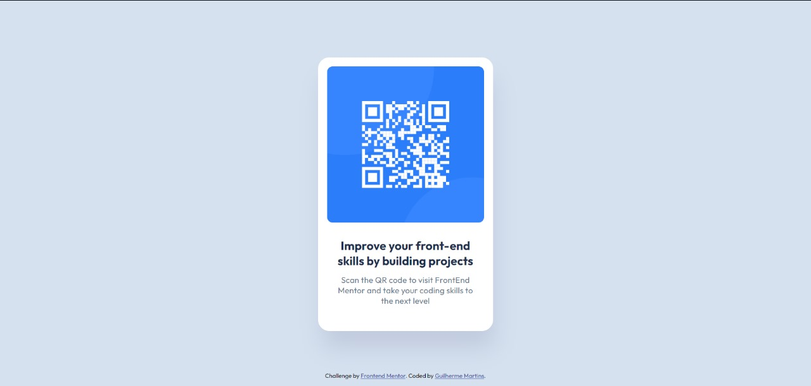

# Frontend Mentor - QR code component solution

This is a solution to the [QR code component challenge on Frontend Mentor](https://www.frontendmentor.io/challenges/qr-code-component-iux_sIO_H). Frontend Mentor challenges help you improve your coding skills by building realistic projects.

## Table of contents

- [Overview](#overview)
  - [Screenshot](#screenshot)
  - [Links](#links)
- [My process](#my-process)
  - [Built with](#built-with)
  - [What I learned](#what-i-learned)
  - [Continued development](#continued-development)
  - [Useful resources](#useful-resources)
- [Author](#author)
- [Acknowledgments](#acknowledgments)

**Note: Delete this note and update the table of contents based on what sections you keep.**

## Overview

### Screenshot



### Links

- Solution URL: [My Codes](https://github.com/ReverseGamerG/qr-code-project-frontend-mentor)
- Live Site URL: [My site](https://reversegamerg.github.io/qr-code-project-frontend-mentor/)

## My process

### Built with

- Semantic HTML5 markup
- CSS custom properties
- Flexbox
- CSS Grid
- Mobile-first workflow
- Figma

### What I learned

Use this section to recap over some of your major learnings while working through this project. Writing these out and providing code samples of areas you want to highlight is a great way to reinforce your own knowledge.

To see how you can add code snippets, see below:

```html
<h1>class= "Atributtion"</h1>
```

```css
.proud-of-this-css {
  box-shadow;
}
```

### Continued development

I want continue learning about CSS and JavaScript for my personal development

### Useful resources

- [Example resource 1](https://fonts.google.com) - This helped me for put the font the challenge was asking. I really liked this pattern and will use it going forward.

## Author

- Frontend Mentor - [ReverseGamerG](https://www.frontendmentor.io/profile/yourusername)
- Twitter - [@ReverseGM](https://www.twitter.com/ReverseGM)

## Acknowledgments

This is where you can give a hat tip to anyone who helped you out on this project. Perhaps you worked in a team or got some inspiration from someone else's solution. This is the perfect place to give them some credit.

```
Thank you rockseat for help me to iniciating coding!
```
